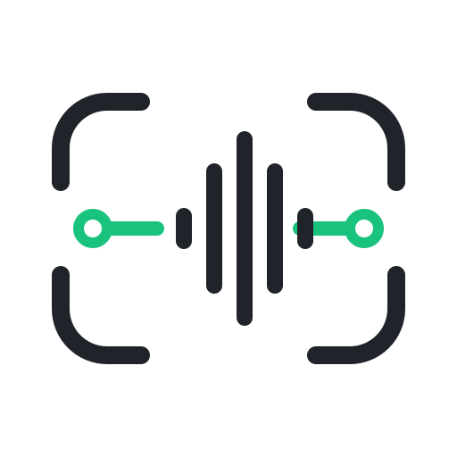
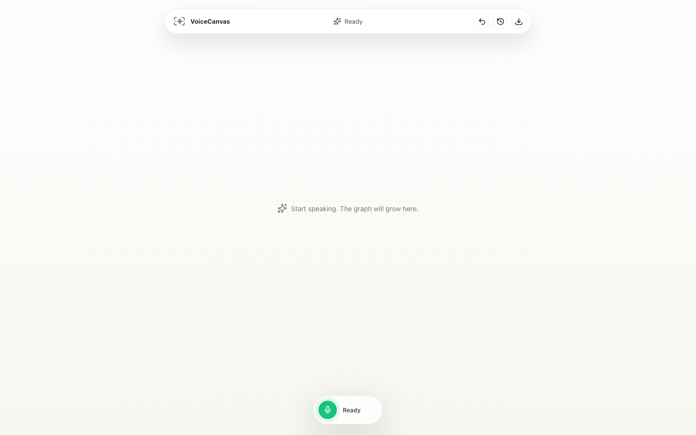
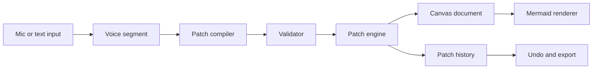

<p align="center">
  
</p>

<h1 align="center">VoiceCanvas</h1>

<p align="center">
  <strong>Speak a diagram into shape.</strong>
</p>

<p align="center">
  <a href="README.zh-CN.md">中文</a>
  ·
  <a href="docs/prd/README.md">Product docs</a>
  ·
  <a href="#quick-start">Quick start</a>
  ·
  <a href="#contributing">Contributing</a>
</p>

<p align="center">
  
  
  
  
  
</p>

<p align="center">
  
</p>

VoiceCanvas is a voice-first diagram workbench. It turns natural speech into validated graph patches, applies those patches to a Mermaid-backed canvas, and keeps every change reversible through patch history.

The project is currently an early engineering prototype. It is useful for exploring the interaction model, running the local demo, and building toward a real open-source diagram editor where the main workflow is continuous voice editing.

## Why This Exists

Most diagram tools make people stop thinking and start operating the UI. Most AI diagram generators handle the first draft better than the tenth edit. VoiceCanvas focuses on the work that happens after the first shape appears: renaming nodes, adding branches, changing flows, confirming ambiguous targets, and undoing a bad patch without rebuilding the whole graph.

The long-term bet is simple: diagrams should change at the speed of a conversation, while the underlying graph remains structured, validated, and exportable.

## Highlights

| Area | Status | What it does |
| --- | --- | --- |
| Voice-first command flow | Working prototype | Accepts text segments and optional realtime ASR input. |
| Patch-based editing | Working prototype | Converts commands into atomic graph operations. |
| Validation layer | Working prototype | Checks patch drafts before they mutate the canvas. |
| Mermaid renderer | Working prototype | Renders the first diagram surface with Mermaid. |
| Low-confidence confirmation | Working prototype | Shows target candidates before applying ambiguous edits. |
| History and undo | Working prototype | Stores applied patches and restores the previous canvas state. |
| Doubao realtime ASR bridge | Optional | Proxies microphone audio to Doubao ASR through the API server. |
| External patch compiler | Optional | Uses an OpenAI-compatible model endpoint when configured. |
| Local mock compiler | Built in | Runs the demo without model credentials. |
| JSON export | Working prototype | Exports the current structured canvas document. |

## Architecture



The model is treated as a patch planner. It can propose a draft, but the canvas only changes after the draft passes validation and the patch engine applies it. That split keeps graph state inspectable, makes undo reliable, and leaves room to swap ASR or model providers later.

## Repository Layout

```text
apps/
  web/          React + Vite workbench
  api/          Hono API, workspace state, realtime ASR bridge
packages/
  core/         CanvasDoc model, patch engine, validator, Mermaid export
  ai/           OpenAI-compatible model patch compiler adapter
  eval/         Acceptance cases and metric helpers
docs/
  prd/          Product, interaction, roadmap, and system design docs
skills/
  voicecanvas-dev-debug-acceptance/
```

## Quick Start

### Requirements

- Node.js 24+
- pnpm 10+

### Run the local workbench

```bash
pnpm install
cp .env.example .env
pnpm dev
```

Open the web app:

```text
http://localhost:5173
```

The API server runs on:

```text
http://localhost:8787
```

The Vite dev server proxies `/api` and realtime WebSocket traffic to the API server. You can run the project without external credentials; empty model settings use the built-in mock patch compiler.

## Configuration

Create `.env` from `.env.example` and fill only the providers you want to use.

### Realtime ASR

```bash
DOUBAO_API_KEY=
DOUBAO_ASR_RESOURCE_ID=volc.bigasr.sauc.duration
DOUBAO_ASR_MODEL=bigmodel
DOUBAO_ASR_URL=wss://openspeech.bytedance.com/api/v3/sauc/bigmodel_async
```

### External Patch Compiler

```bash
PATCH_COMPILER_API_KEY=
PATCH_COMPILER_BASE_URL=
PATCH_COMPILER_MODEL=
PATCH_COMPILER_PROVIDER=
```

When the patch compiler variables are empty, VoiceCanvas uses the local mock compiler. That makes the demo easy to run in forks, CI, and offline experiments.

## Scripts

| Command | Description |
| --- | --- |
| `pnpm dev` | Start the web and API apps together. |
| `pnpm dev:web` | Start only the Vite app. |
| `pnpm dev:api` | Start only the Hono API server. |
| `pnpm test` | Run unit tests across the workspace. |
| `pnpm lint` | Run lint checks. |
| `pnpm build` | Build apps and type-check packages. |
| `pnpm test:e2e` | Run Playwright smoke tests. |

## API Surface

| Method | Path | Purpose |
| --- | --- | --- |
| `GET` | `/health` | API health check. |
| `GET` | `/api/canvas` | Read the current workspace snapshot. |
| `POST` | `/api/dev/reset` | Reset the in-memory prototype workspace. |
| `POST` | `/api/commands/text-segment` | Process a text segment as a voice command. |
| `POST` | `/api/patch/compile` | Compile a patch draft without applying it. |
| `POST` | `/api/patch/apply` | Apply a provided patch draft. |
| `POST` | `/api/patch/confirm` | Confirm a low-confidence candidate. |
| `POST` | `/api/patch/undo` | Restore the previous patch state. |
| `GET` | `/api/realtime/provider` | Read realtime ASR provider settings. |
| `GET` | `/api/export/json` | Export the current `CanvasDoc`. |

## Development Notes

- Source file names use `kebab-case`.
- React component exports use `PascalCase`.
- React hooks live in `apps/web/src/hooks` and use `use-*.ts`.
- Tests use `*.test.ts` or `*.spec.ts`.
- Generated build and test output should stay out of source control.
- Workspace packages are private packages for now, while the repository itself is MIT licensed.

## Roadmap

| Stage | Focus |
| --- | --- |
| Prototype | One-shot diagram creation, simple local edits, undo, candidate confirmation, JSON export. |
| Alpha | More reliable continuous editing, selected-object voice commands, local layout improvements, image export. |
| Beta | Flowchart and mind map coverage, stronger evaluation cases, shareable outputs, real user feedback loops. |
| Later | Team workspaces, meeting mode, permissions, provider marketplace, richer diagram types. |

See [docs/prd](docs/prd/README.md) for the longer product and technical plan.

## Contributing

Issues and small focused pull requests are welcome. Before sending a change, run the checks that match your edit:

```bash
pnpm test
pnpm lint
pnpm build
pnpm test:e2e
```

Good first areas:

- Improve acceptance cases in `packages/eval`.
- Add more mock compiler commands in `packages/core`.
- Tighten API tests around patch confirmation and undo.
- Improve workbench interactions in `apps/web`.
- Expand provider adapters in `packages/ai`.

## License

MIT. See [LICENSE](LICENSE).
