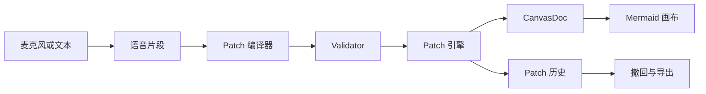

<p align="center">
  
</p>

<h1 align="center">VoiceCanvas</h1>

<p align="center">
  <strong>边说边改图的语音画布。</strong>
</p>

<p align="center">
  <a href="README.md">English</a>
  ·
  <a href="docs/prd/README.md">产品文档</a>
  ·
  <a href="docs/prototype-acceptance.md">Prototype 检查</a>
  ·
  <a href="#快速开始">快速开始</a>
  ·
  <a href="#参与贡献">参与贡献</a>
</p>

<p align="center">
  
  
  
  
  
</p>

<p align="center">
  
</p>

VoiceCanvas（声图）是一款语音优先的图形工作台。用户说出一句自然话，系统把它编译成经过校验的图 Patch，再作用到画布上；每一步都有历史、撤回和候选确认，方便连续改图。

项目目前处于早期工程原型阶段，适合看思路、跑 demo、参与实验性开发。核心目标很简单：用户把注意力放在图上，用口语完成新增节点、改名、加分支、撤回、导出等动作。

## 为什么做这个项目

传统画图工具经常打断思考，用户得在“想结构”和“操作 UI”之间来回切。很多 AI 画图工具可以生成第一张图，但第十次修改会变得麻烦：用户要重新描述全局，图也可能大幅变化。

VoiceCanvas 关注第一张图出现之后的工作：改名称、加分支、换顺序、确认模糊目标、撤回错误 Patch。长期目标是让图跟着对话持续变化，同时底层图结构依然可校验、可复原、可导出。

## 功能亮点

| 能力 | 状态 | 说明 |
| --- | --- | --- |
| 语音优先指令链路 | 原型可用 | 支持文本片段，也支持 OpenAI Realtime 语音输入。 |
| Patch 化图编辑 | 原型可用 | 把指令转成原子图操作。 |
| Validator 校验层 | 原型可用 | Patch 生效前先检查结构合法性。 |
| Mermaid 渲染 | 原型可用 | 首版画布使用 Mermaid 展示流程图。 |
| 低置信候选确认 | 原型可用 | 目标不清楚时先展示候选项。 |
| 历史与撤回 | 原型可用 | 记录已执行 Patch，并可复原上一步画布。 |
| OpenAI Realtime 语音 | 可选 | 浏览器里使用 `openai/realtime-voice-component`，API 服务代理 session。 |
| 外部 Patch 编译器 | 可选 | 兼容 OpenAI 风格模型接口。 |
| 本地 Mock 编译器 | 内置 | 没有模型凭据也能跑 demo。 |
| JSON 导出 | 原型可用 | 导出当前结构化 `CanvasDoc`。 |

## 架构



模型在这里负责提出 Patch 草稿。画布只会在草稿通过校验、Patch 引擎执行后变化。这个拆分让图状态更容易检查，撤回更可靠，也让语音识别和图编辑保持清晰边界。

## 项目结构

```text
apps/
  web/          React + Vite 工作台
  api/          Hono API、工作区状态、Realtime session 代理
packages/
  core/         CanvasDoc 模型、Patch 引擎、Validator、Mermaid 导出
  ai/           OpenAI 兼容模型 Patch 编译器适配
  eval/         评测用例与指标辅助
docs/
  prd/          产品、交互、路线图、系统设计文档
skills/
  voicecanvas-dev-debug-acceptance/
```

## 快速开始

### 环境要求

- Node.js 24+
- pnpm 10+

### 启动本地工作台

```bash
pnpm install
cp .env.example .env
pnpm dev
```

打开前端：

```text
http://localhost:5173
```

API 服务地址：

```text
http://localhost:8787
```

Vite 开发服务会把 `/api` 请求代理到 API 服务。外部模型配置为空时，项目会使用内置 Mock Patch 编译器。

## 配置

从 `.env.example` 创建 `.env`，只填写你要启用的服务。

### 实时语音

```bash
OPENAI_API_KEY=
OPENAI_REALTIME_MODEL=gpt-realtime-1.5
```

### 外部 Patch 编译器

```bash
PATCH_COMPILER_API_KEY=
PATCH_COMPILER_BASE_URL=
PATCH_COMPILER_MODEL=
PATCH_COMPILER_PROVIDER=
```

Patch 编译器变量为空时，VoiceCanvas 使用本地 Mock 编译器。这样 fork、CI、离线实验都可以直接跑。

## 常用脚本

| 命令 | 说明 |
| --- | --- |
| `pnpm dev` | 同时启动 Web 和 API。 |
| `pnpm dev:web` | 只启动 Vite 前端。 |
| `pnpm dev:api` | 只启动 Hono API 服务。 |
| `pnpm test` | 运行 workspace 单元测试。 |
| `pnpm lint` | 运行 lint 检查。 |
| `pnpm build` | 构建应用并做类型检查。 |
| `pnpm test:e2e` | 运行 Playwright 冒烟测试。 |
| `pnpm check:prototype` | 运行完整 Prototype 检查。 |
| `pnpm check:alpha` | 运行 Alpha 检查并生成本地评测报告。 |
| `pnpm check:alpha:realtime` | 运行 OpenAI Realtime session 代理测试。 |

## API

| Method | Path | 用途 |
| --- | --- | --- |
| `GET` | `/health` | API 健康检查。 |
| `GET` | `/api/canvas` | 读取当前工作区快照。 |
| `POST` | `/api/dev/reset` | 重置内存里的原型工作区。 |
| `POST` | `/api/commands/text-segment` | 把文本片段按语音指令处理。 |
| `POST` | `/api/patch/compile` | 只编译 Patch 草稿，不执行。 |
| `POST` | `/api/patch/apply` | 执行给定 Patch 草稿。 |
| `POST` | `/api/patch/confirm` | 确认低置信候选项。 |
| `POST` | `/api/patch/undo` | 复原上一步 Patch 状态。 |
| `GET` | `/api/realtime/provider` | 查看实时语音服务配置。 |
| `POST` | `/api/realtime/openai/session` | 代理 WebRTC session offer 到 OpenAI Realtime。 |
| `GET` | `/api/export/json` | 导出当前 `CanvasDoc`。 |

## 开发约定

- 源码文件名使用 `kebab-case`。
- React 组件导出使用 `PascalCase`。
- React hooks 放在 `apps/web/src/hooks`，命名为 `use-*.ts`。
- 测试文件使用 `*.test.ts` 或 `*.spec.ts`。
- 构建与测试产物不要进入版本库。
- workspace 包目前是 private package；仓库使用 MIT License。

## 路线图

| 阶段 | 重点 |
| --- | --- |
| Prototype | 一句话建图、简单局部编辑、撤回、候选确认、JSON 导出。 |
| Alpha | 更可靠的连续编辑、选中对象后语音修改、局部布局优化、图片导出。 |
| Beta | 流程图与思维导图覆盖、更完整的评测用例、可分享结果、真实用户反馈循环。 |
| 后续 | 团队工作区、会议模式、权限、服务商扩展、更丰富的图类型。 |

更完整的产品与技术规划见 [docs/prd](docs/prd/README.md)。

## 参与贡献

欢迎 issue 和小范围 PR。提交改动前，按改动范围运行对应检查：

```bash
pnpm test
pnpm lint
pnpm build
pnpm test:e2e
```

适合优先做的方向：

- 在 `packages/eval` 增加评测用例。
- 在 `packages/core` 增加更多 Mock 编译器指令。
- 加强 Patch 确认与撤回相关 API 测试。
- 改进 `apps/web` 工作台交互。
- 扩展 `packages/ai` 的模型服务适配。

## License

MIT. See [LICENSE](LICENSE).
