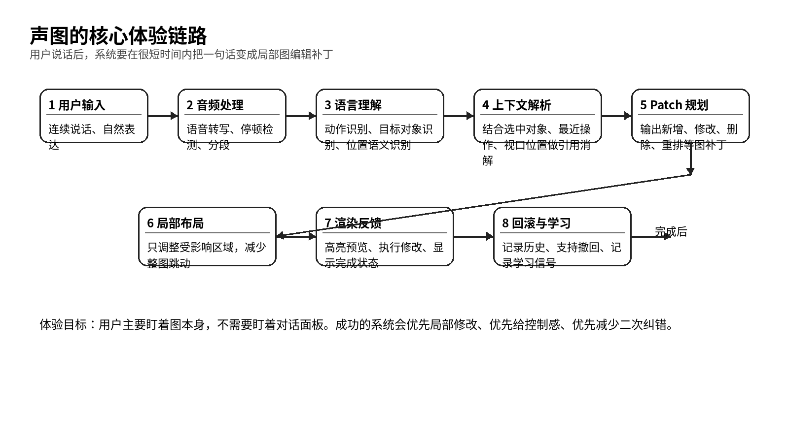

# 这是一款让用户边说边改的语音画布

> 总 PRD 与总体方案

- 产品代号：声图  VoiceCanvas
- 版本：PRD 套件 v1.0

| 字段 | 内容 |
| --- | --- |
| 文档目标 | 给出产品的总定义、价值判断、范围边界、体验目标和首年成功标准。 |
| 适用读者 | 创始团队、产品、设计、研发、投资人、试点客户。 |
| 本文回答的问题 | 这是什么产品；为什么现在值得做；它先做什么；什么叫做做好。 |
| 与其他文档关系 | 这是总览文档，其他七份文档会把用户、路线图、功能、交互、界面、技术和经营方案分别展开。 |

## 一、这款产品的结论已经很清楚

声图是一款语音优先、画布优先、增量编辑优先的智能画图产品。用户打开以后，主要看到的是画布本身。用户说出一句自然的话，系统会把这句话转成局部图编辑补丁，然后直接在图上完成新增、修改、删除、重排、合并、拆分等动作。

用户的真实工作状态，通常是边想边说、边说边改。现有产品大多能做到一句话生成一张图，却很难撑起连续编辑。声图要抓住的价值就在这里：让用户像和同事站在白板前那样，把脑子里的结构直接说出来，让图持续长出来。

*图 1  声图的核心体验链路*

## 二、现在做这件事有明确的窗口

市场里已经有很多「文本生成图」工具，也有很多语音输入工具，但这两类能力大多还没有被打造成一个顺手的连续改图产品。用户每次改图，还是要写完整指令，还是要盯着旁边的聊天框，还是会遇到整图跳动、局部难控、上下文丢失这些问题。

从技术条件看，流式语音识别、上下文理解、大模型规划、局部布局引擎、画布渲染引擎，现在都已经足够成熟，可以把第一代产品做出来。机会点不在单点能力，而在把整条链路磨成一个产品体验。

| 机会点 | 现状 | 声图的切入方式 |
| --- | --- | --- |
| 用户表达方式 | 用户想到什么就会先说出来 | 直接接受自然语言和口语化表达 |
| 现有 AI 图工具 | 生成能力强，连续改图弱 | 把「连续改图」做成核心能力 |
| 语音工具 | 语音转文字成熟，但对图结构理解很弱 | 围绕图对象和上下文做引用消解 |
| 团队协作 | 会议讨论很多，沉淀成图很慢 | 让图在讨论中直接形成 |

## 三、这个产品先服务五类人

第一类是产品经理和业务分析人员。他们经常要整理流程、规则、页面关系、状态流转。第二类是创始人和业务负责人，他们脑子里有判断，但不愿意被复杂工具打断。第三类是咨询、运营、售前等需要快速表达方案的人。第四类是老师、研究者、内容创作者，他们需要把思路拆开再组织起来。第五类是技术架构和系统设计人员，这一类会在第二阶段以后逐步接入。

| 用户类型 | 高频任务 | 最痛的点 | 声图的价值 |
| --- | --- | --- | --- |
| 产品经理 | 画流程、梳理规则、开需求会 | 改图很费手，沟通内容难沉淀 | 讨论过程中直接形成可编辑图 |
| 创始人/负责人 | 讲方案、搭框架、对齐方向 | 脑子比手快，工具跟不上 | 让结构随着说话同步出现 |
| 咨询/运营/售前 | 拆方案、做展示、讲逻辑 | 时间紧，图常常要反复改 | 连续语音编辑提高出稿速度 |
| 老师/研究者 | 搭知识框架、拆概念 | 发散和收敛切换频繁 | 支持思维导图与流程图切换 |
| 技术架构 | 梳理服务关系、流程与异常 | 对象关系复杂 | 后续扩展到更强的结构化图 |

## 四、产品要解决的核心问题只有三个
1. 用户表达是连续的，图编辑却是离散的。用户明明只是想补一层、改一支、挪一下顺序，却被迫重新描述全局。
1. 画布里的对象很多，用户会说「这里」「上面那个」「右边这一支」，系统如果没有上下文，就很容易改错。
1. 用户要的是控制感。系统如果每轮都重画整图，用户很快就会失去信任。

因此，声图的产品原则要非常坚定。第一，画布永远是主角。第二，系统优先局部修改。第三，系统优先给出轻量确认，而不是长对话。第四，系统每轮都保留可回滚的补丁。第五，语音只是入口，真正的核心是结构化编辑。

## 五、第一阶段的范围要收得很稳

第一阶段只做流程图和思维导图，只做单人桌面使用场景，只做从空白建图和对已有图的连续语音修改，不碰多人同时语音输入，不碰复杂行业图规范，不做长时间开放麦常驻监听。这样做的目的很明确：先把最关键的体验做对。

| 模块 | 第一阶段支持 | 暂不支持 |
| --- | --- | --- |
| 图类型 | 流程图、思维导图 | BPMN、复杂 UML、ER 图 |
| 用户形态 | 单人工作台 | 多人同时说话改同一张图 |
| 输入方式 | 连续语音、选中后语音、键盘补充 | 全天候语音常驻 |
| 输出 | PNG、PDF、可编辑文件、结构化 JSON | 复杂行业交换格式 |
| 智能能力 | 新增、修改、删除、局部重排、撤回 | 高度自动的风格美化引擎 |

## 六、成功体验应该长成这样

用户进入产品以后，点一下语音条，说「先给我画一个用户注册流程」。系统在几秒内出现基础流程。用户接着说「手机号验证后加一个验证码校验」「失败要回到上一步」「右边再加一个管理员审批分支」「把这条支线排紧凑一点」。整个过程中，用户的目光一直停在图上。系统只在低置信场景下用高亮和短确认来打断用户。

如果把这个体验压缩成一句话，可以写成：「你在说，图在长。」这就是声图要交付的东西。

## 七、产品能力由八个核心模块组成

| 模块 | 一句定义 | 首要目标 |
| --- | --- | --- |
| 画布引擎 | 承载节点、连线、分组、布局与视图 | 支持稳定的局部编辑 |
| 语音条 | 承载听、停、理解、确认、完成等状态 | 让用户知道系统正在做什么 |
| 意图理解 | 从自然话里识别动作、对象、关系和位置 | 尽量不用命令式语言 |
| 引用消解 | 理解这里、那个、刚刚那一支等指代 | 减少改错 |
| Patch 规划器 | 把一句话拆成可执行的图补丁 | 保证可回滚、可统计 |
| 局部布局器 | 只移动受影响区域 | 减少整图跳动 |
| 历史与回滚 | 按轮记录编辑补丁 | 给用户控制感 |
| 导出与分享 | 把结果导出为图、文档或可编辑格式 | 进入真实工作流 |

## 八、北极星指标要围绕三件事来设计
1. 用户有没有真的少动手。可以看单张图的鼠标点击次数、拖拽次数、平均输入字数。
1. 系统有没有真的改对。可以看单轮编辑成功率、连续三轮成功率、撤回率、二次纠正率。
1. 用户有没有真的觉得顺。可以看完成一张图的总时长、七日留存、二次创建率、团队内复用率。

| 指标 | 首年目标 | 解释 |
| --- | --- | --- |
| 一句建图成功率 | ≥ 70% | 第一句就能生成用户愿意继续改的基础图 |
| 连续三轮编辑成功率 | ≥ 60% | 证明系统能撑起连续改图 |
| 单图撤回率 | ≤ 20% | 过高说明系统经常改错 |
| 单图完成时长下降 | ≥ 40% | 与传统手动画图相比 |
| 试点客户周活留存 | ≥ 35% | 证明产品进入真实流程 |

## 九、首年目标不该贪多

第一年最重要的目标，是在一个足够窄但足够高频的场景里把体验打透。建议优先抓住「产品经理与业务负责人在单人桌面端连续改流程图」这个主场景。只要这个场景建立起明显优势，后续再扩到会议记录、团队协作、行业模板、企业权限，都会容易很多。

第一年要少承诺，多验证。产品应该先成为一个让用户愿意反复打开的工具，再去谈平台化和大规模团队采购。

## 十、这个项目为什么值得继续推进

从需求强度看，用户的表达速度一直快于手工建图速度。只要产品能稳定接住连续表达，它就会带来明显效率收益。从竞争格局看，很多产品停在一次性生成，真正把「边说边改」做顺的玩家还不多。从实现路径看，第一版需要的关键技术已经具备工程可行性。

因此，这个项目值得进入下一步，也就是把用户、路线图、功能规格、交互设计、界面设计、系统链路、商业化和上线验证全部展开，并进入阶段化执行。
