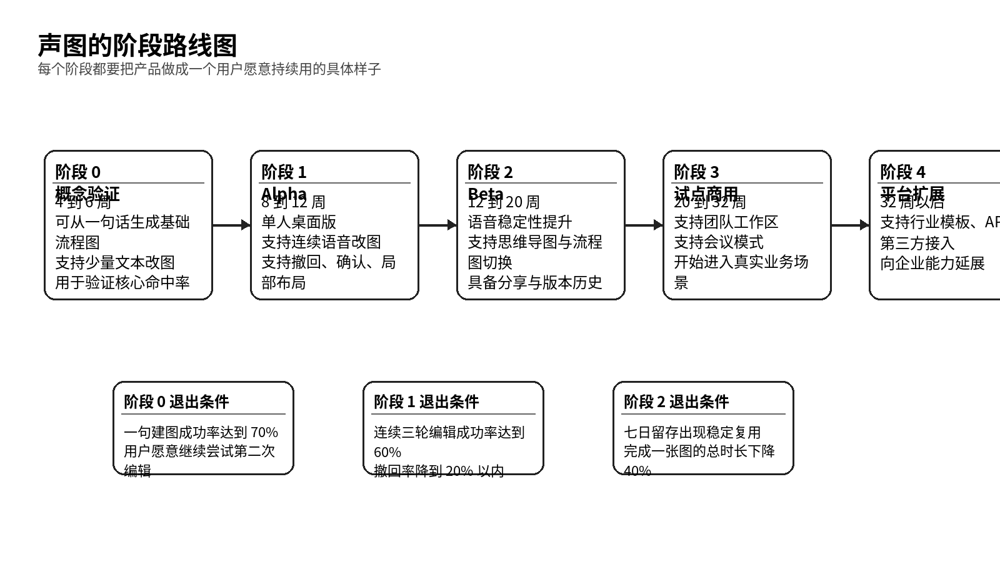

# 产品必须按阶段做成可用而且可控的样子

> 路线图、版本规划与里程碑

- 产品代号：声图  VoiceCanvas
- 版本：PRD 套件 v1.0

| 字段 | 内容 |
| --- | --- |
| 文档目标 | 把阶段目标、版本边界、可交付状态、退出条件和资源节奏写清楚。 |
| 适用读者 | 创始团队、产品、研发负责人、投资人、项目管理。 |
| 本文回答的问题 | 先做哪一段；每一段做成什么样；什么叫达到下一阶段门槛。 |
| 与其他文档关系 | 本文件把总 PRD 里的方向拆成可执行的阶段计划。 |

## 一、路线图要服从一个原则

每个阶段都必须把产品做成一个具体、完整、有人愿意用的样子，而不是只堆功能点。声图尤其需要这样做，因为它的价值来自体验链路。只做出几块看起来很厉害的能力，并不能代表产品成立。

因此，路线图的判断标准不只是功能完成度，还包括体验完整度、成功率、留存和用户信任。

*图 2  声图的阶段路线图*

## 二、阶段 0 要证明一句建图和局部编辑真的可行

| 维度 | 阶段 0 的要求 |
| --- | --- |
| 目标 | 做出概念验证版，证明一句建图和简单局部编辑在技术上与体验上都跑得通。 |
| 时间 | 4 到 6 周 |
| 产品形态 | 单人桌面 Demo，支持流程图基础对象，支持文本补充输入 |
| 必须支持 | 一句建图、改名称、加节点、加分支、撤回上一步 |
| 可以先忽略 | 复杂布局、完整导出、团队分享 |
| 退出条件 | 一句建图成功率达到 70%，用户在第一次生成后愿意继续尝试第二轮编辑 |

这个阶段的产品看起来应该像一个粗糙但可信的原型。画面可以不精致，范围可以很窄，但核心链路必须通，尤其是「说一句，图就改」的反馈。

## 三、阶段 1 要把连续改图做成一个单人可用产品

| 维度 | 阶段 1 的要求 |
| --- | --- |
| 目标 | 从概念验证走向可用 Alpha，让单人用户在真实工作里完成一张流程图。 |
| 时间 | 8 到 12 周 |
| 产品形态 | 桌面版工作台，具备画布、语音条、对象检查器、历史抽屉 |
| 必须支持 | 连续语音改图、选中后再说、低置信确认、局部布局、版本历史、导出图片 |
| 质量门槛 | 连续三轮编辑成功率至少 60%，撤回率不高于 20%，简单编辑平均时长控制在 2.5 秒以内 |
| 退出条件 | 种子用户能够独立完成 10 张以上真实工作图，并愿意在下一周继续回来用 |

阶段 1 的样子应该已经像一个产品。用户可以带着自己的真实任务来用，哪怕还有局限，也会觉得这东西开始有工作价值。

## 四、阶段 2 要把首个主场景打透

| 维度 | 阶段 2 的要求 |
| --- | --- |
| 目标 | 把「单人桌面端连续改流程图」做成明显优于传统方式的体验，同时打开思维导图场景。 |
| 时间 | 12 到 20 周 |
| 产品形态 | Beta 版，支持流程图与思维导图、支持更多图操作、支持更稳定的导出与分享 |
| 必须支持 | 图类型切换、连续八轮编辑、结构化导出、评论备注、基础模板 |
| 质量门槛 | 单图完成时长较传统方式下降 40%，七日留存出现稳定复用，连续八轮中有 5 轮以上编辑被用户认为准确 |
| 退出条件 | 至少 3 个试点团队在周会、需求讨论或方案整理中稳定使用 |

阶段 2 的产品应该能让外部用户说出一句很关键的话：「我已经开始把它带进工作里用了。」

## 五、阶段 3 要证明从个人工具到团队工具的跨越

| 维度 | 阶段 3 的要求 |
| --- | --- |
| 目标 | 增加会议模式、团队工作区和共享能力，让产品在多人协作链路里成立。 |
| 时间 | 20 到 32 周 |
| 产品形态 | 试点商用版，支持会议场景下的持续沉淀与会后回看 |
| 必须支持 | 共享空间、只读与可编辑权限、会议模式、评论、版本比较、链接分享 |
| 质量门槛 | 团队月留存明显高于个人用户，会议场景下可形成会后可复用图稿 |
| 退出条件 | 至少 2 个付费试点客户愿意续约或扩点 |

阶段 3 的关键不是把企业功能堆满，而是证明团队愿意把这块画布放进自己的协作流程。

## 六、阶段 4 才是平台和行业扩展

| 维度 | 阶段 4 的要求 |
| --- | --- |
| 目标 | 在核心体验稳定后，扩展行业模板、API、第三方接入和更复杂图能力。 |
| 时间 | 32 周以后 |
| 产品形态 | 平台化版本，面向更广的团队和企业接入场景 |
| 必须支持 | 模板市场、开放接口、管理员能力、审计日志、更细的对象权限 |
| 可以新增 | 行业专用图、知识库接入、多语言和跨端扩展 |
| 退出条件 | 具备稳定商业模型和规模化交付能力 |

这个阶段要晚一点再做。基础体验没站稳之前，平台化会把团队拉散。

## 七、每个阶段产品要长成什么样

| 阶段 | 用户看到的样子 | 用户能完成的事 | 团队要警惕的坑 |
| --- | --- | --- | --- |
| 阶段 0 | 像一个强演示原型 | 说一句生成图，再补一两轮简单修改 | 别为了演示而硬编码太多 |
| 阶段 1 | 像一个真正可用的单人工具 | 独立完成一张流程图并导出 | 别让整图重排和改错拖垮信任 |
| 阶段 2 | 像一个愿意每天打开的生产工具 | 持续改图、切换图类型、保存版本、分享结果 | 别过早加入复杂团队功能 |
| 阶段 3 | 像一个能进会议和协作链路的团队产品 | 在讨论中沉淀图并在会后继续改 | 别让多人场景把基础稳定性拉低 |
| 阶段 4 | 像一个能接企业流程的平台 | 把声图嵌进更大的工作系统 | 别为大客户定制过度 |

## 八、节奏安排要和风险拆解对齐

| 时间段 | 主要目标 | 核心输出物 | 主负责人 |
| --- | --- | --- | --- |
| 第 1 到 2 周 | 明确对象模型与最小图类型 | 图引擎框架、Patch 结构、首版提示词规范 | 产品 + 技术 |
| 第 3 到 6 周 | 跑通阶段 0 | 概念验证 Demo、基础指标埋点、首轮用户测试 | 技术 + 设计 |
| 第 7 到 12 周 | 构建 Alpha 主工作台 | 画布、语音条、历史、导出、基础异常流 | 前端 + 设计 + 语音链路 |
| 第 13 到 20 周 | 打磨 Beta 主场景 | 思维导图支持、稳定性优化、试点包 | 产品 + 技术 + 客户成功 |
| 第 21 到 32 周 | 开启团队试点 | 会议模式、共享空间、权限与结算草案 | 增长 + 产品 + 技术 |

## 九、阶段退出不看感觉，要看硬指标

| 阶段 | 必须看到的指标 | 说明 |
| --- | --- | --- |
| 阶段 0 | 一句建图成功率 ≥ 70% | 没有这一点，用户不会进入第二轮 |
| 阶段 1 | 连续三轮编辑成功率 ≥ 60% | 证明系统能撑起连续改图 |
| 阶段 1 | 撤回率 ≤ 20% | 撤回率过高说明系统经常改错 |
| 阶段 2 | 单图完成时长下降 ≥ 40% | 要有真实效率优势 |
| 阶段 2 | 七日留存出现稳定复用 | 说明用户愿意回来 |
| 阶段 3 | 试点团队月留存稳定 | 说明团队链路成立 |
| 阶段 3 | 至少 2 个付费试点 | 开始验证商业意愿 |

## 十、版本规划还要绑定研发依赖

| 能力 | 最早需要完成的阶段 | 原因 | 依赖模块 |
| --- | --- | --- | --- |
| 流式语音识别 | 阶段 0 | 没有连续输入就没有主体验 | 音频链路 |
| 对象模型与 Patch | 阶段 0 | 后续所有局部编辑都依赖它 | 图引擎 |
| 引用消解 | 阶段 1 | 这里、那个这类表达是高频 | 上下文系统 |
| 局部布局 | 阶段 1 | 决定用户控制感 | 图引擎 + 渲染 |
| 版本历史 | 阶段 1 | 支撑撤回与回放 | 存储 + Patch |
| 图类型切换 | 阶段 2 | 拓展到知识整理场景 | 对象模型 |
| 共享与权限 | 阶段 3 | 团队协作的基础 | 服务端与账号系统 |

## 十一、要提前承认的主要风险
1. 技术上能跑通，但连续多轮编辑的稳定性不够，导致留存起不来。
1. 产品看起来很新，但用户实际只把它当成偶尔玩一下的演示工具。
1. 团队过早进入多人协作和企业能力，结果主体验没有打透。
1. 图引擎没有从一开始就围绕 Patch 设计，后期很难扩展和回滚。

路线图的意义，就是一边推进，一边用阶段退出条件对冲这些风险。

## 十二、里程碑管理建议

建议每两周做一次里程碑回顾，不只看开发任务是否完成，还要回看真实用户是否真的更顺了。每个里程碑都要带着一组真实任务去验收，例如「完成一张注册流程图」「把一张三层思维导图扩成五层」「在会后 10 分钟内把会议内容整理成图」。

只要阶段目标和真实任务之间始终对齐，声图的路线图就不会变成一张空规划图。
