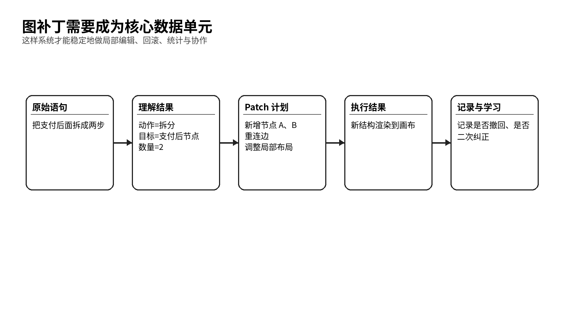

# 功能必须围绕画布、语音和增量编辑展开

> 信息架构、对象模型与功能规格

- 产品代号：声图  VoiceCanvas
- 版本：PRD 套件 v1.0

| 字段 | 内容 |
| --- | --- |
| 文档目标 | 定义系统的对象层次、信息架构、功能模块、规则约束与首版规格。 |
| 适用读者 | 产品经理、交互设计师、前后端研发、测试。 |
| 本文回答的问题 | 系统里有哪些对象；每个模块做什么；什么行为被允许；如何定义首版边界。 |
| 与其他文档关系 | 本文件给交互设计和技术方案提供直接规格输入。 |

## 一、信息架构要从画布出发

声图的顶层信息架构建议分成六层：账号与工作区层、项目层、画布层、图对象层、编辑会话层、导出与版本层。这样划分的好处是很直接，用户看到的是项目和画布，系统关注的是对象与补丁，业务层关注的是版本与分享。

| 层级 | 对象 | 说明 |
| --- | --- | --- |
| 账号与工作区 | 用户、团队、权限、设置 | 承载身份、空间归属和权限策略 |
| 项目 | 项目、文件夹、标签 | 组织多张画布和项目资料 |
| 画布 | 画布、视口、缩放、网格、图类型 | 承载当前编辑空间 |
| 图对象 | 节点、边、分组、泳道、注释、区域 | 图的核心结构 |
| 编辑会话 | 语音会话、转写片段、确认任务、补丁序列 | 承载连续交互过程 |
| 版本与导出 | 版本快照、历史、导出任务、分享链接 | 承载结果输出和追踪 |

## 二、对象模型要尽早定死

产品初期最容易犯的错误，是把图当成一堆可以随便渲染的形状。声图不能这么做。声图必须把图当成稳定的对象集合，每个节点、每条边、每个分组都要有稳定 ID 和明确类型。只有这样，连续编辑、引用消解、回滚、协作和统计才站得住。

| 对象 | 关键字段 | 说明 |
| --- | --- | --- |
| Node 节点 | id、type、text、meta、position、size、status | 最基础对象，可表示步骤、概念、判断、输入、输出等 |
| Edge 连线 | id、source、target、label、type、condition | 表示关系、方向和条件 |
| Group 分组 | id、memberIds、title、layoutMode | 表示逻辑区块或层级集合 |
| Canvas 画布 | id、diagramType、viewport、theme、grid | 承载当前图和显示状态 |
| Patch 补丁 | id、ops、confidence、sourceText、time | 每轮编辑的最小可追踪单元 |
| Session 会话 | id、segments、selectedIds、contextRef | 承载一段连续语音和上下文 |

## 三、首版只开放两种图类型

| 图类型 | 对象集合 | 常见动作 | 限制规则 |
| --- | --- | --- | --- |
| 流程图 | 开始/结束、处理、判断、边、注释、分组 | 新增步骤、加判断、补异常分支、改顺序、合并步骤 | 必须存在明确方向，判断节点可有多分支 |
| 思维导图 | 主题、一级分支、子分支、备注、分组 | 新增分支、合并分支、提升层级、下沉层级、改主题 | 以树状层级为主，不强调流程方向 |

这两种图类型之间要允许在一定范围内转换，但转换后的结构必须给用户看得懂。比如思维导图转流程图时，系统应要求用户选择一条主路径，不能随意猜。

## 四、功能结构建议按八大模块组织

### 1. 主页与项目组织

提供新建、最近打开、模板入口、文件夹、标签、搜索和收藏。首版保持极简，避免把太多管理功能拉到前面。

### 2. 画布工作台

画布需要包含顶部工具栏、中央画布区、右侧对象检查器、底部语音条和可折叠历史抽屉。默认不显示长对话流。

### 3. 语音与编辑会话

支持点一下连续说、按住说、选中后再说。每轮语音都要形成一段转写、一个理解结果和一个或多个 Patch。

### 4. Patch 编辑器

负责把一句话拆成具体操作，例如新增节点、修改文本、连接边、删除节点、调整布局等。Patch 必须可回滚。

### 5. 低置信确认

当系统对引用对象不确定时，优先高亮候选对象，再使用一句短确认。尽量不把用户拖进长对话。

### 6. 历史与版本

用户可以撤回上一步、撤回某一轮语音编辑，也可以回看完整版本。首版先做单人版本。

### 7. 导出与分享

至少支持 PNG、PDF、可编辑格式和结构化 JSON。图片导出服务展示，结构化导出服务后续编辑与系统接入。

### 8. 设置与偏好

用户可以设置语言、麦克风、默认图类型、自动确认阈值、逐字稿显示方式等。

## 五、自然语言动作集要先定义清楚

| 动作类 | 系统支持的动作 | 示例表达 |
| --- | --- | --- |
| 创建 | 新建图、新增节点、新增边、新增分支、新增分组 | 这里加一个审核节点 |
| 修改 | 改名称、改顺序、改层级、改类型、改条件 | 把这个改成管理员审批 |
| 删除 | 删节点、删分支、删备注、删关系 | 把右边那条支线删掉 |
| 重组 | 合并、拆分、归类、提炼、转图类型 | 把支付后面拆成两步 |
| 布局 | 对齐、紧凑、展开、靠左、横向、纵向 | 把这一支排紧凑一点 |
| 控制 | 撤回、恢复、放大、缩小、聚焦 | 撤回刚才那一步 |

这里有一个原则要反复强调：系统支持的应该是自然表达，不要求用户记命令。动作集是给系统和团队看的，不是给用户背的。

## 六、引用消解要依赖四类上下文

| 上下文 | 来源 | 作用 |
| --- | --- | --- |
| 当前选中对象 | 用户手动选中或系统上轮高亮 | 帮助理解「这里」「这个」 |
| 最近修改对象 | 上一轮或最近几轮 Patch | 帮助理解「刚才那个」「上一条支线」 |
| 当前视口中心 | 画布可见区域与焦点位置 | 帮助理解「上面」「左边第二个」 |
| 语义关系邻近 | 图结构中的父子、前后、并列关系 | 帮助理解「后面那个」「这一层」 |

只有这四类上下文一起工作，系统才有机会把口语化表达解得稳。

## 七、Patch 需要成为功能规格的核心单位

*图 3  图补丁生命周期*

Patch 的设计建议遵循四条规则。第一，Patch 只描述变化，不重复整张图。第二，Patch 可以组合，一个复杂动作可以拆成多个原子操作。第三，Patch 必须记录来源语句、置信度、命中的对象和执行结果。第四，Patch 必须支持完整回滚。

| Patch 操作 | 说明 | 示例 |
| --- | --- | --- |
| addNode | 新增一个节点 | 在手机号验证后新增验证码校验 |
| updateNode | 修改节点属性 | 把名称改成人工复核 |
| deleteNode | 删除节点 | 删除废弃支线 |
| addEdge | 新增关系 | 把判断节点连到异常处理 |
| moveSubtree | 移动一个子树或分支 | 把这一支挪到右边 |
| changeLayout | 改变局部布局策略 | 改成横向排布 |

## 八、功能规格要写到可验收

| 模块 | 需求编号 | 需求描述 | 验收标准 |
| --- | --- | --- | --- |
| 一句建图 | FR-001 | 用户在空白画布中说一句完整目标，系统生成基础图 | 3 秒内看到基础图；结构至少包含主干和两层关系 |
| 连续改图 | FR-002 | 用户在已有图上继续说话，系统局部修改 | 三轮连续编辑中，至少两轮无需手动纠正 |
| 低置信确认 | FR-003 | 系统对目标对象不确定时发起确认 | 确认流程不超过两步；用户可语音或点击确认 |
| 撤回 | FR-004 | 用户可撤回单轮或多轮 Patch | 撤回后图状态准确回到前一版本 |
| 导出 | FR-005 | 用户可导出图片或文档 | 导出结果与当前画布一致 |

## 九、异常与空态也要定义清楚

| 情形 | 系统表现 | 产品原则 |
| --- | --- | --- |
| 没听清 | 提示用户再说一遍，并保留上轮画布不变 | 宁可不改，也不要乱改 |
| 对象不唯一 | 高亮多个候选并短确认 | 先缩小范围，再执行 |
| 图过大 | 提示只操作当前视口或当前分组 | 避免全局误伤 |
| 结构冲突 | 提示可能带来的结果并给预览 | 复杂变更先预览后执行 |
| 网络波动 | 保留本地缓冲和转写草稿 | 让用户感知到系统在继续努力 |

## 十、首版不做的事需要写在规格里
1. 不做多人同时语音输入同一张图。
1. 不做复杂行业规范自动校验。
1. 不做高度复杂的视觉主题系统。
1. 不做开放式自动脑暴代理，避免产品失焦。
1. 不做对外开放平台和 API。

这些限制写清楚以后，团队在设计和开发时就更容易守住重心。

## 十一、测试策略要围绕行为正确而不是只围绕控件

测试不应只验证按钮能不能点、窗口会不会打开。更关键的是验证一句自然的话能否被正确转成补丁，补丁是否作用在正确的对象上，布局是否只影响必要区域，撤回后是否完全恢复。

| 测试层 | 关注点 | 样例 |
| --- | --- | --- |
| 单元测试 | Patch 操作正确性 | 新增、删除、重连、回滚 |
| 集成测试 | 语音到补丁链路 | 不同表达方式是否映射为同类动作 |
| 端到端测试 | 用户任务完成率 | 从空白到导出完成一张图 |
| 人工验收 | 视觉与控制感 | 整图是否乱跳、确认是否打断过度 |

## 十二、这份规格的价值

这份规格真正的价值，在于帮助团队始终记住：声图的中心不是聊天，不是图形皮肤，也不是酷炫演示，而是把自然表达稳定地变成图结构变化。只要信息架构和对象模型围着这个目标建立，后续交互和技术就不会跑偏。
