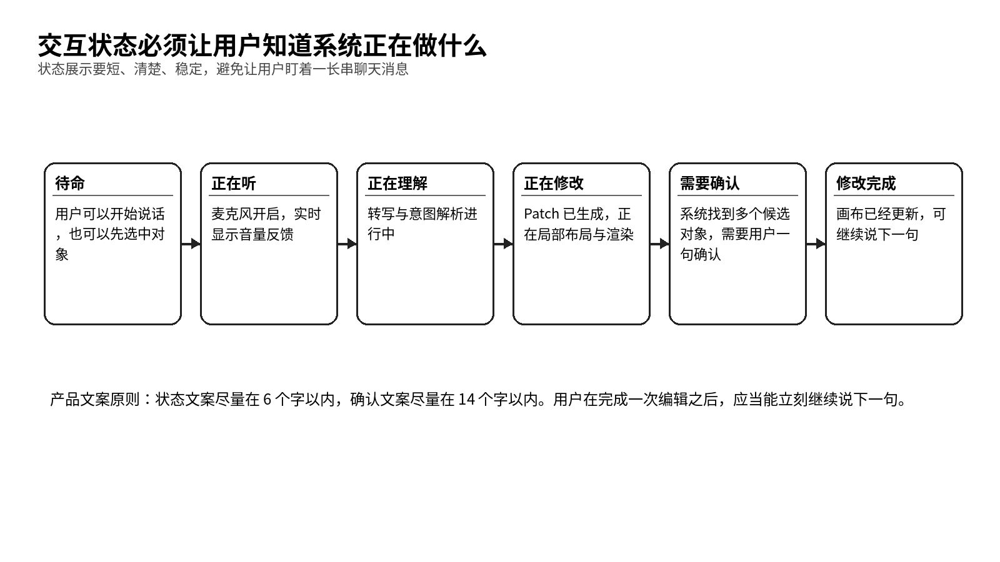
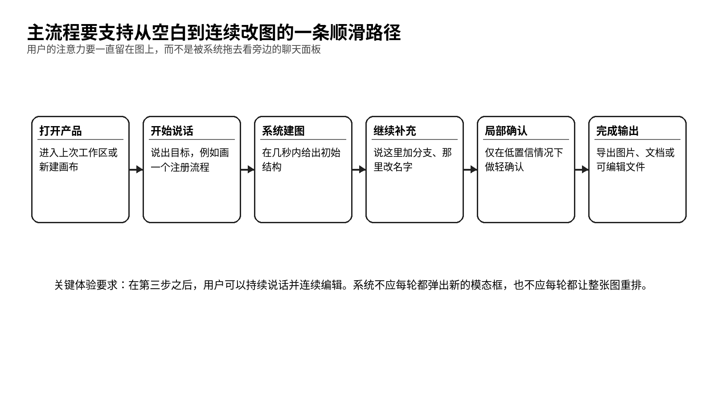
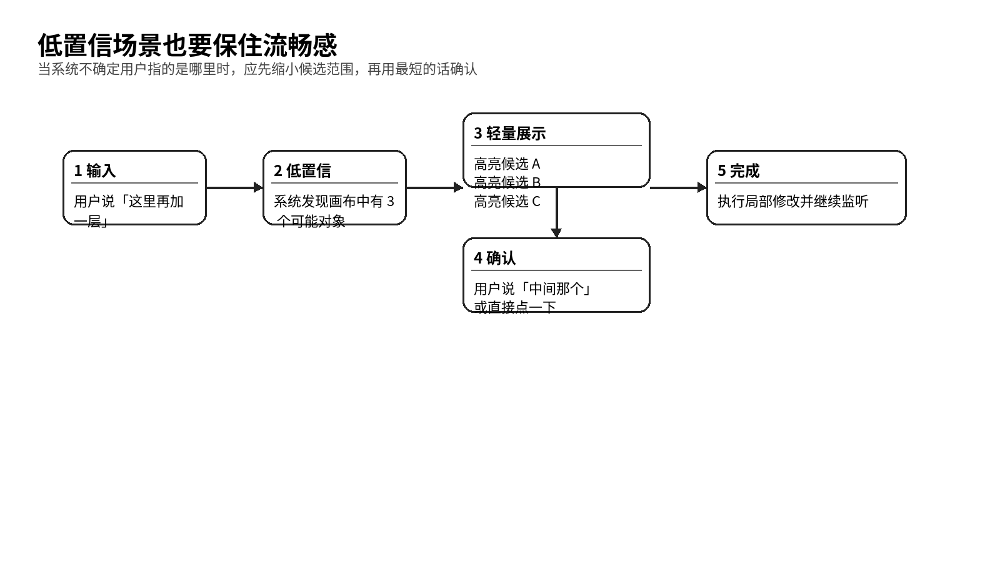

# 交互必须让用户一直盯着图而不是盯着聊天框

> 用户流程、交互设计与异常流

- 产品代号：声图  VoiceCanvas
- 版本：PRD 套件 v1.0

| 字段 | 内容 |
| --- | --- |
| 文档目标 | 把用户从进入产品到导出结果的主要路径、状态机、异常流和文案原则写清楚。 |
| 适用读者 | 产品、交互设计、前端研发、测试、客户成功。 |
| 本文回答的问题 | 用户怎么开始；系统怎么回应；低置信怎么处理；什么时候需要确认；哪些行为要避免。 |
| 与其他文档关系 | 本文件是界面设计、技术链路和验收测试的直接依据。 |

## 一、交互设计的目标只有一句话

让用户把注意力尽量留在图上。对声图来说，这句话不是一句风格口号，而是整个交互设计的核心判断标准。只要某个交互方案迫使用户经常转头去看一长串聊天内容，它就偏离了目标。

因此，交互设计要努力做到三件事：让开始足够快，让连续编辑足够顺，让低置信处理足够轻。

## 二、系统状态需要非常明确

*图 4  交互状态模型*

| 状态 | 触发条件 | 界面反馈 | 用户下一步 |
| --- | --- | --- | --- |
| 待命 | 初始进入或上一轮完成 | 底部语音条显示待命，麦克风可点击 | 开始说话或先选对象 |
| 正在听 | 用户启动麦克风 | 语音条显示音量波动和收听状态 | 持续说话 |
| 正在理解 | 检测到句段结束 | 语音条转为理解中，画布保持稳定 | 等待 1 到 2 秒 |
| 正在修改 | Patch 生成并通过检查 | 目标区域高亮，局部对象变化开始出现 | 观察结果 |
| 需要确认 | 引用对象或结构结果不确定 | 高亮候选对象，给出短确认 | 语音确认或点击确认 |
| 修改完成 | 渲染结束 | 语音条短暂显示完成，回到待命 | 继续说下一句 |
| 失败 | 未理解或执行冲突 | 轻提示，画布回到原状态 | 重说或手动补充 |

## 三、主流程要围绕三步走
1. 先生成一个可继续编辑的基础图。
1. 再围绕基础图做连续增量修改。
1. 最后导出、分享或进入下一轮协作。

*图 5  从空白到连续改图的主流程*

## 四、主流程 A 从空白到第一张图

| 步骤 | 用户行为 | 系统行为 | 设计原则 |
| --- | --- | --- | --- |
| A1 | 进入产品并新建画布 | 展示空白画布和底部语音条 | 尽量少让用户做前置选择 |
| A2 | 说出第一句话 | 实时收听并转写 | 优先识别主题和主干，不急着装满细节 |
| A3 | 停顿结束 | 进行理解与图规划 | 给出明确的处理中反馈 |
| A4 | 生成基础图 | 在画布中央出现首版图 | 首版图要整洁、可继续改 |
| A5 | 用户观察并继续说 | 系统回到待命或保持连续监听 | 尽量不打断用户思路 |

这里的关键点，在于首版图的密度要适中。图太空，用户觉得没帮到忙。图太满，用户会觉得自己失去控制。

## 五、主流程 B 对已有图连续修改

| 步骤 | 用户的话可能会怎么说 | 系统动作 | 可视反馈 |
| --- | --- | --- | --- |
| B1 | 这里加一个审批 | 识别目标对象和新增动作 | 目标节点高亮 |
| B2 | 失败回到上一步 | 新增异常分支并重连边 | 新增节点与边短暂高亮 |
| B3 | 把右边这一支排紧凑一点 | 调用局部布局器 | 只移动相关区域 |
| B4 | 上面那个改成人工复核 | 修改节点文本 | 节点文本变化高亮 |
| B5 | 撤回刚才那步 | 按 Patch 回滚 | 相关对象恢复原状 |

连续修改流程的关键，是让每一轮都形成一个完整闭环。用户说完以后，要么看到结果，要么看到轻确认，要么得到失败提示。不能让系统停在一种含糊不清的状态里。

## 六、主流程 C 先选中对象再说

有些用户会更愿意先点中一个节点或一个分支，再开始说修改内容。这种方式会显著降低引用消解的难度，因此首版要重点支持。

| 步骤 | 用户行为 | 系统行为 | 说明 |
| --- | --- | --- | --- |
| C1 | 点击一个节点、分支或分组 | 右侧检查器显示当前对象信息 | 建立显式上下文 |
| C2 | 开始说话 | 自动把选中对象放入理解上下文 | 提高命中率 |
| C3 | 执行修改 | 优先在选中对象内局部修改 | 减少整图误伤 |
| C4 | 结束后继续说 | 保留选中状态或按设置自动取消 | 用户可连续操作 |

## 七、低置信确认要做得像一句简短的追问

*图 6  低置信确认流程*

系统最容易失去用户信任的时刻，就是听得半懂不懂还硬改。声图应该优先保守。对于目标对象不确定、结构结果有歧义、转换图类型会造成明显影响这三类情况，系统都应该先做轻确认。

| 场景 | 推荐确认方式 | 示例文案 |
| --- | --- | --- |
| 对象不唯一 | 高亮 2 到 3 个候选对象并发问 | 你指的是中间这个节点吗 |
| 结构结果不唯一 | 给出两个局部预览 | 你希望拆成串行还是并行 |
| 影响范围较大 | 提示影响并允许撤回 | 这会移动这一整支，继续吗 |

文案原则很简单。尽量短、尽量具体、尽量只问一个问题。

## 八、异常流也要写成正常体验的一部分

| 异常类型 | 用户感受风险 | 系统策略 | 界面表现 |
| --- | --- | --- | --- |
| 没听清 | 用户觉得系统笨 | 提示重说并可显示转写草稿 | 底部轻提示，不改图 |
| 没听完整 | 用户觉得系统抢答 | 支持继续说或合并分段 | 语音条保持理解中 |
| 改错对象 | 用户瞬间失去信任 | 高亮结果并提供一键撤回 | 结果旁显示撤回入口 |
| 网络抖动 | 用户觉得系统卡住 | 本地缓冲与状态提示 | 状态变为连接中 |
| 结构冲突 | 用户不知道发生了什么 | 说明冲突并给预览方案 | 右侧抽屉展开说明 |

## 九、交互里必须保住控制感
1. 所有重要修改都要能撤回。
1. 整图重排属于高影响动作，默认要少做。
1. 图上的变化要短暂高亮，让用户知道哪里被改了。
1. 用户在低置信时可以用语音确认，也可以直接点击确认。
1. 逐字稿默认收起，只有在用户主动展开时才展示。

控制感是连续编辑的底盘。只要用户觉得系统随时会乱来，他就会回到鼠标模式。

## 十、关键文案需要统一

| 场景 | 推荐文案 | 说明 |
| --- | --- | --- |
| 待命 | 点击开始连续说话 | 告诉用户可以直接开始 |
| 理解中 | 我在理解这句话 | 让用户知道系统还在工作 |
| 修改中 | 我在改图 | 比技术术语更自然 |
| 需要确认 | 你指的是这个吗 | 短而明确 |
| 未听清 | 我没有听清，再说一次吧 | 保留友好感 |
| 撤回成功 | 已撤回上一轮修改 | 给出结果回执 |

## 十一、会议模式要和个人模式区分开

会议模式会在第二阶段以后进入。它的交互目标和个人模式不完全一样。个人模式强调快和准，会议模式更强调持续记录、回看和会后整理。会议模式里，逐字稿可以半展开，但仍然要让图在视觉上处于主位。

| 维度 | 个人模式 | 会议模式 |
| --- | --- | --- |
| 输入节奏 | 用户主动控制每句输入 | 可能持续听和按轮切段 |
| 逐字稿 | 默认隐藏 | 可半展开作为辅助 |
| 确认 | 尽量立刻确认 | 必要时允许会后批量确认 |
| 输出 | 一张个人工作图 | 会中图稿加会后整理结果 |

## 十二、交互验收要围绕用户任务

| 任务 | 通过标准 | 失败信号 |
| --- | --- | --- |
| 从空白生成一张注册流程图 | 第一次生成后用户愿意继续说第二句 | 用户立刻转向手工拖拽 |
| 连续补 3 个分支 | 至少 2 轮无需手动纠正 | 每轮都要靠右侧面板修正 |
| 用这里、那个改图 | 系统在轻确认后命中目标 | 系统误伤其他分支 |
| 撤回并恢复 | 用户能快速回到上一版 | 撤回后仍有残留影响 |

交互设计做到最后，团队应该能回答一个很具体的问题：用户能不能在几乎不切走注意力的情况下，完成一整段边说边改的任务。只要这个问题的答案越来越稳，产品就在往前走。
