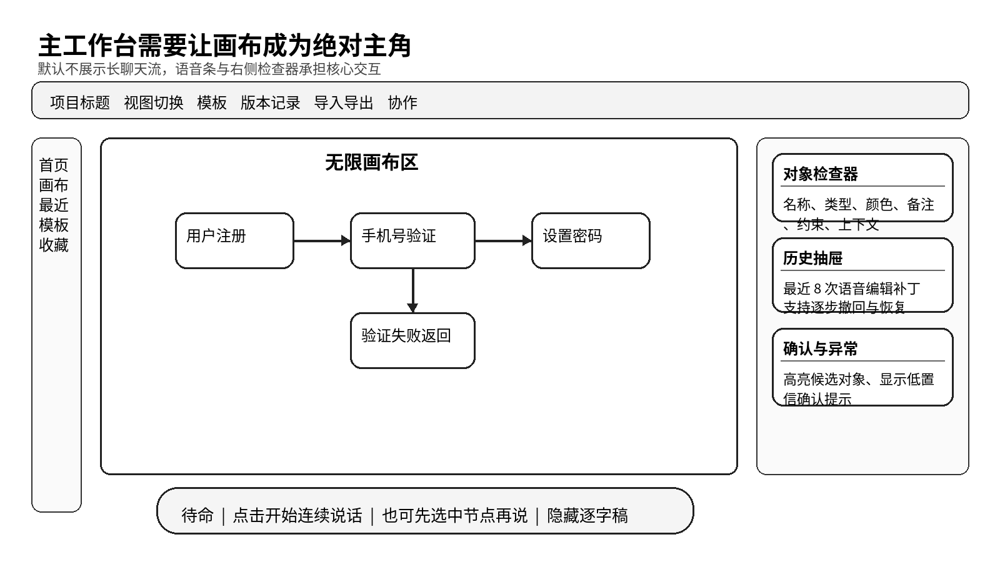

# 界面必须让画布成为主角并让语音自然嵌进去

> 界面设计、布局方案与组件规范

- 产品代号：声图  VoiceCanvas
- 版本：PRD 套件 v1.0

| 字段 | 内容 |
| --- | --- |
| 文档目标 | 定义桌面端主界面、关键页面、组件规则、视觉原则和响应式策略。 |
| 适用读者 | UI 设计师、交互设计师、前端研发、品牌设计。 |
| 本文回答的问题 | 界面要长成什么样；画布、语音条、右侧面板如何分工；不同状态如何呈现。 |
| 与其他文档关系 | 本文件承接用户流程文档，为研发和高保真设计提供基准。 |

## 一、界面设计要回答的第一件事

界面最重要的任务，不是展示 AI 有多聪明，而是让用户安心地把注意力放在图上。声图的界面应该给人一种很直接的感觉：中间是工作本身，语音是自然嵌进去的能力。

## 二、桌面端工作台是最重要的一张屏

*图 7  主工作台线框图*

| 区域 | 位置 | 作用 | 是否默认可见 |
| --- | --- | --- | --- |
| 顶部工具栏 | 顶部横向 | 项目标题、视图切换、模板、版本、导入导出、协作入口 | 是 |
| 左侧轻导航 | 左侧窄栏 | 主页、最近、模板、收藏等导航 | 是 |
| 中央画布区 | 中间大区域 | 核心绘图区与对象展示区 | 是 |
| 右侧检查器 | 右侧面板 | 显示当前选中对象与历史、异常、确认内容 | 是 |
| 底部语音条 | 底部居中 | 承载收听、理解、确认、完成状态 | 是 |
| 逐字稿抽屉 | 右侧或底部抽屉 | 查看近几轮转写内容 | 否 |

这张主工作台必须尽量稳。用户每次回来都应该看到相似的骨架。频繁变化的应该是图本身，不是工作台布局。

## 三、首页要承担轻入口而不是重管理

首页的目标是让用户尽快进入一张画布。建议包含最近项目、新建画布、模板入口、会议记录入口和收藏。首版不建议把复杂的数据面板、协作动态、活动流堆在首页。

| 首页模块 | 说明 | 首版建议 |
| --- | --- | --- |
| 最近打开 | 最近编辑的画布和项目 | 保留 |
| 新建入口 | 空白流程图、空白思维导图、从模板创建 | 保留 |
| 模板推荐 | 常用结构模板 | 保留但数量控制在 6 个以内 |
| 团队动态 | 谁编辑了什么 | 首版可以不做 |
| 学习与提示 | 帮助用户快速上手 | 保留为轻卡片 |

## 四、底部语音条是最关键的界面组件

底部语音条既像按钮，也像状态栏，还像一条轻量交互面板。它必须清楚告诉用户系统现在处于什么阶段，同时又不能占据太多注意力。

| 状态 | 语音条样式 | 需要展示的信息 | 需要避免的事 |
| --- | --- | --- | --- |
| 待命 | 单一主按钮样式 | 开始说话入口、默认模式 | 展示过长说明 |
| 正在听 | 出现音量反馈与停止入口 | 收听中提示、转写片段 | 转写滚得太长 |
| 正在理解 | 主文案切为理解中 | 处理中状态、预计很快有结果 | 让用户误以为卡死 |
| 正在修改 | 可短暂高亮动画 | 告诉用户我在改图 | 遮挡画布 |
| 需要确认 | 出现两个到三个确认按钮或候选标签 | 对象确认、结构确认 | 弹出大模态框 |
| 完成 | 短暂成功反馈后回到待命 | 已完成一轮 | 停留太久影响下一轮 |

## 五、右侧检查器要负责解释而不是夺权

右侧检查器主要做三件事。第一，显示当前选中对象。第二，显示最近几轮编辑与撤回入口。第三，在低置信和异常时给出简短说明。它不应该变成一个复杂的聊天面板，也不应该把所有结果先堆成文本。

| 分区 | 内容 | 默认高度建议 |
| --- | --- | --- |
| 对象检查器 | 名称、类型、颜色、备注、约束、上下文引用 | 200 到 260 px |
| 历史抽屉 | 最近 8 轮 Patch、撤回、恢复、版本标签 | 160 到 220 px |
| 确认与异常 | 候选对象、高影响提示、冲突说明 | 120 到 180 px |
| 逐字稿入口 | 查看近几轮转写 | 折叠状态，仅一行入口 |

## 六、画布区的视觉原则要围绕稳定感
1. 默认网格和辅助线尽量弱，不喧宾夺主。
1. 节点样式统一，类型差异用轻量方式区分。
1. 被修改对象需要短暂高亮 600 到 1200 毫秒。
1. 低置信候选对象要有边框高亮和编号标记，方便用户说「第二个」。
1. 局部重排时尽量只移动相关区域，其余区域保持不动。

画布视觉上的最大风险，不是丑，而是乱。只要用户觉得每次说一句整张图都在跳，界面就失败了。

## 七、组件规范要早一点定下来

| 组件 | 用途 | 交互要求 | 备注 |
| --- | --- | --- | --- |
| 节点卡片 | 显示图对象 | 支持选中、悬停、重命名、拖拽 | 统一圆角与内边距 |
| 边与箭头 | 表示顺序和关系 | 支持选中、改条件、重连 | 条件文字尽量简短 |
| 组框 | 表示一个分组或区域 | 支持整体移动和整体重排 | 弱化视觉重量 |
| 高亮层 | 表示系统正在操作哪些对象 | 短时显示，可叠加编号 | 是 AI 感知的关键反馈 |
| 候选标签 | 表示低置信候选对象 | 可点击，也可语音编号确认 | 控制数量 |
| 历史卡片 | 显示最近一轮 Patch | 支持撤回和查看详情 | 默认只展示一行摘要 |

## 八、视觉样式建议保持克制

| 设计项 | 建议 |
| --- | --- |
| 颜色 | 以中性色为主，强调色只用于当前状态和高亮反馈 |
| 字体 | 桌面端正文 11 到 12 号，节点标题 12 到 14 号 |
| 圆角 | 节点建议 12 到 16 px，面板建议 16 到 20 px |
| 间距 | 采用 4、8、12、16、24 的基础间距系统 |
| 阴影 | 轻阴影即可，避免厚重悬浮感 |
| 动画 | 优先位移和边框高亮，少做花哨效果 |

整体视觉应当更接近高效办公产品，而不是聊天娱乐产品。

## 九、不同页面与状态要有明确差异

| 页面或状态 | 布局重点 | 用户目标 |
| --- | --- | --- |
| 首页 | 让用户快速进入工作 | 尽快开始 |
| 空白画布 | 突出语音条和模板入口 | 顺利起步 |
| 已有图画布 | 突出局部编辑与历史 | 持续修改 |
| 低置信确认 | 突出候选对象与短确认 | 快速决定 |
| 导出页 | 突出格式与范围选择 | 输出结果 |
| 回放与版本 | 突出时间线和 Patch 列表 | 复盘与恢复 |

## 十、响应式策略建议以桌面优先

首版建议以桌面端为主，平板端作为次级适配，手机端只做查看和轻编辑。原因很直接：连续改图对画布面积和对象密度要求较高，小屏幕会明显拉低体验。

| 端 | 首版策略 | 说明 |
| --- | --- | --- |
| 桌面端 | 全功能 | 主战场 |
| 平板端 | 查看、轻编辑、语音补充 | 可在会议和移动场景使用 |
| 手机端 | 查看、评论、轻量确认 | 先不承担重度编辑 |

## 十一、高保真设计前先把几个关键页面画透
1. 首页。
1. 空白画布初始态。
1. 已有图连续编辑态。
1. 低置信确认态。
1. 导出与分享态。
1. 版本回放态。

只要这六个页面被设计透，首版产品的大部分体验就已经有了骨架。

## 十二、界面验收建议

| 检查项 | 验收问题 |
| --- | --- |
| 注意力分配 | 用户是否能自然把目光放在图上 |
| 状态清晰度 | 用户是否总能知道系统在听、在想还是在改 |
| 修改可见性 | 用户是否能一眼看出哪里被改了 |
| 控制感 | 撤回、确认、恢复是否顺手 |
| 密度控制 | 画布是否整洁，信息是否不过载 |

界面设计做到这里，才算真正服务了产品。因为它已经不只是漂亮，而是把「边说边改」这件事承托住了。
