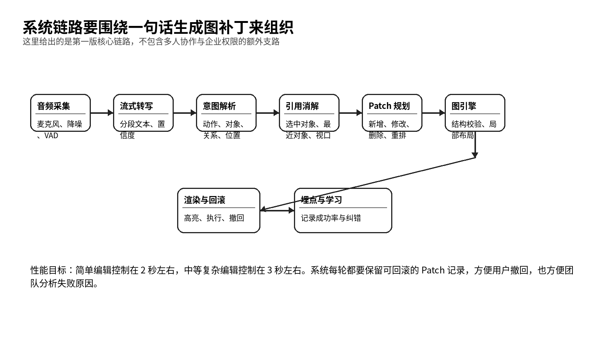

# 系统必须把一句话稳定地变成图补丁

> 系统链路、技术方案与架构设计

- 产品代号：声图  VoiceCanvas
- 版本：PRD 套件 v1.0

| 字段 | 内容 |
| --- | --- |
| 文档目标 | 定义从音频输入到图补丁执行的系统链路、数据结构、性能预算和可靠性策略。 |
| 适用读者 | 技术负责人、前后端研发、算法、测试、运维、安全。 |
| 本文回答的问题 | 系统链路怎么走；核心模块怎么拆；性能和可靠性怎么控；数据如何记录。 |
| 与其他文档关系 | 本文件承接功能规格和交互设计，为研发排期和架构决策提供依据。 |

## 一、系统目标不是做一个会聊天的代理

技术架构的目标很明确：把用户一句自然的话稳定地转成图补丁，并把这个补丁以可预期、可回滚、可统计的方式作用到画布上。系统可以用到大模型，但大模型在这里扮演的是规划器，不是主角。真正的主角，是稳定的对象模型和补丁执行链路。

## 二、端到端链路由八个核心模块构成

*图 8  声图的核心系统链路*

| 模块 | 输入 | 输出 | 职责 |
| --- | --- | --- | --- |
| 音频采集层 | 麦克风音频流 | 去噪后的分段音频 | 降噪、回声抑制、静音检测 |
| 语音识别层 | 分段音频 | 实时转写片段 | 流式转写与置信度输出 |
| 语言理解层 | 转写文本与会话上下文 | 动作、对象、位置、结构意图 | 抽取编辑意图 |
| 引用消解层 | 意图与画布状态 | 目标对象集合与置信度 | 理解这里、那个、上一支等指代 |
| Patch 规划层 | 编辑意图与目标对象 | 补丁序列 | 把一句话拆成可执行操作 |
| 图引擎 | 补丁序列 | 更新后的对象图 | 做结构校验和局部布局 |
| 渲染反馈层 | 更新后的对象图 | 界面反馈 | 高亮、执行、确认、撤回入口 |
| 分析存储层 | 会话与补丁日志 | 历史与指标 | 记录版本、成功率、错误原因 |

## 三、音频链路建议采用流式架构

音频链路要处理的不是一段完整录音，而是正在发生的表达过程。建议采用实时采集加语音活动检测的方式，把用户的话切成若干自然片段。切分不要太短，避免系统频繁抢答；也不要太长，避免延迟过大。

| 环节 | 建议策略 | 说明 |
| --- | --- | --- |
| 语音活动检测 | 基于停顿与能量阈值切段 | 控制响应时机 |
| 降噪 | 本地预处理优先 | 减少背景噪音影响 |
| 流式转写 | 边说边出片段，结束后出最终版 | 提高响应速度 |
| 语言检测 | 首版支持中文，兼容中英混说 | 贴近真实办公场景 |

## 四、语言理解层要围绕结构化结果设计

语言理解层不要直接输出大段自然语言建议，而要输出结构化结果。建议格式至少包含动作、目标对象、目标位置、关系类型、影响范围、置信度和是否需要确认。这样做能显著降低后续执行的不确定性。

| 字段 | 说明 | 示例 |
| --- | --- | --- |
| action | 动作类型 | addNode、updateNode、deleteNode |
| targetRef | 目标对象引用 | currentSelection、lastEdited、nodeId |
| placement | 放置规则 | after、before、childOf、parallelTo |
| relation | 关系含义 | successPath、failurePath、detailBranch |
| impactScope | 影响范围 | local、subtree、global |
| confidence | 理解置信度 | 0.82 |
| needsConfirm | 是否要确认 | true |

## 五、引用消解层是成败关键

很多看起来像模型理解问题的失败，其实都发生在引用消解层。比如用户说「这里再加一层」，模型未必听不懂「加一层」，真正难的是「这里」指什么。建议引用消解层独立成模块，不要完全交给通用模型隐式完成。

| 输入信号 | 权重建议 | 用途 |
| --- | --- | --- |
| 当前选中对象 | 最高 | 显式指向 |
| 最近编辑对象 | 高 | 承接连续表达 |
| 当前视口中心 | 中 | 帮助定位上面、下面、左边 |
| 语义邻近对象 | 中 | 帮助定位后面那个、同级那个 |
| 历史对话片段 | 中低 | 处理跨句承接 |

系统可以给每个候选对象算一个分数。如果最高分和第二名差距明显，就直接执行。如果差距不够大，就进入轻确认。

## 六、Patch 规划层建议采用两步式

第一步先生成高层编辑计划，也就是用户这一句到底想达成什么。第二步再把高层计划拆成一个或多个原子 Patch。这样可以把复杂编辑的规划与执行分离开，便于调试和回滚。

| 层次 | 输出物 | 例子 |
| --- | --- | --- |
| 高层计划 | plan | 在手机号验证后新增一个失败分支并回连 |
| 原子补丁 | ops[] | addNode、addEdge、updateLayout |

原子 Patch 要足够小，保证每一条失败时都能定位原因。

## 七、图引擎要坚持局部布局

图引擎的主要职责有两个。一个是结构合法性检查，另一个是局部布局。首版不要追求最复杂的自动美化算法，先把局部稳定做到位。用户对声图的要求，首先是别乱动。

| 职责 | 说明 | 首版策略 |
| --- | --- | --- |
| 结构校验 | 检查边是否断裂、是否出现无意义环路、层级是否合理 | 规则引擎加白名单 |
| 局部布局 | 只移动受影响区域 | 从变更节点向外扩散一到两层 |
| 冲突处理 | 当编辑结果和现有结构冲突 | 先预览再执行 |
| 类型转换 | 流程图与思维导图的结构映射 | 要求用户确认主路径 |

## 八、性能预算要在系统设计里前置

| 阶段 | 目标耗时 | 说明 |
| --- | --- | --- |
| 音频切段和提交 | 100 到 200 毫秒 | 停顿后尽快进入理解阶段 |
| 流式转写最终稿 | 300 到 600 毫秒 | 视模型与网络情况 |
| 语言理解与引用消解 | 300 到 700 毫秒 | 简单编辑尽量压低 |
| Patch 规划 | 100 到 300 毫秒 | 原子 Patch 不宜过多 |
| 图引擎执行与渲染 | 300 到 800 毫秒 | 局部布局是耗时重点 |
| 总耗时 | 简单编辑 2 秒左右，中等复杂编辑 3 秒左右 | 用户能接受少量延迟 |

用户通常能接受一点等待，但无法接受无反馈。即便某一轮要 3 秒，也要在前 300 毫秒内让用户看到系统已经听到了他。

## 九、数据结构要支持版本、学习和诊断

| 数据对象 | 需要记录什么 | 用途 |
| --- | --- | --- |
| Session | 开始时间、结束时间、输入模式、语言、设备 | 分析会话稳定性 |
| TranscriptSegment | 转写内容、置信度、时间戳 | 复盘 ASR 问题 |
| IntentResult | 动作、对象、位置、置信度、是否确认 | 复盘理解问题 |
| Patch | 原子操作、执行结果、失败原因、耗时 | 回滚与技术诊断 |
| CanvasVersion | 版本号、Patch 列表、导出记录 | 版本回放和协作 |
| UserFeedback | 撤回、重说、满意度 | 优化模型与规则 |

没有这些数据，团队就很难知道系统到底是哪里出了问题。

## 十、安全、隐私和权限不能后补

声图会处理语音、文本和业务图，这里面可能包含敏感信息。因此系统设计一开始就要考虑数据隔离、加密存储、权限控制和日志脱敏。

| 主题 | 首版建议 |
| --- | --- |
| 传输加密 | 语音流、文本、导出文件都走加密通道 |
| 存储加密 | 项目内容、版本、会话日志按租户隔离 |
| 权限 | 单人版先简单，团队版进入细粒度对象权限 |
| 隐私开关 | 允许关闭逐字稿保留和训练样本回收 |
| 审计 | 记录谁在何时导出了什么 |

## 十一、可观测性要覆盖整条链路

| 监控点 | 关键指标 | 告警信号 |
| --- | --- | --- |
| 音频链路 | 输入失败率、切段错误率 | 某设备或浏览器异常升高 |
| 转写链路 | 转写耗时、空结果率 | 网络或模型异常 |
| 理解链路 | 需要确认比例、理解失败率 | 提示意图解析退化 |
| Patch 执行 | 执行失败率、回滚失败率 | 图引擎问题 |
| 用户侧 | 撤回率、二次纠正率、流失点 | 体验问题 |

对声图来说，撤回率和二次纠正率是很重要的线上健康指标。它们比单纯的调用成功率更接近真实体验。

## 十二、推荐的技术实施路线
1. 先用成熟的语音识别服务把流式转写跑稳。
1. 把对象模型、Patch 和局部布局引擎尽早在内部跑起来。
1. 让引用消解层独立出来，用规则加模型混合方式实现。
1. 把所有理解结果都结构化输出，减少直接生成整图的黑盒路径。
1. 在小样本真实任务上循环调优，再进入团队试点。

如果团队一开始就沿着这条路线推进，声图的技术栈会更稳，也更适合后续扩展到会议模式、团队协作和企业接口。
